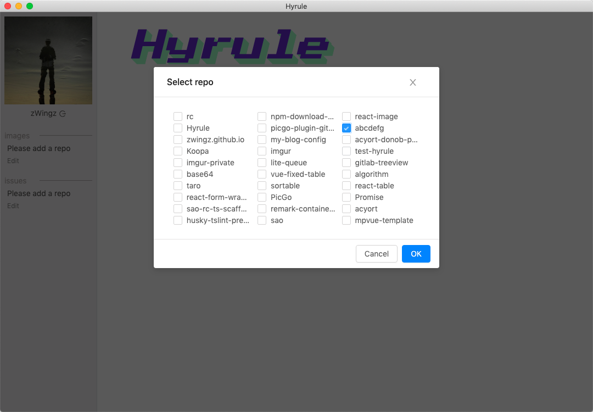
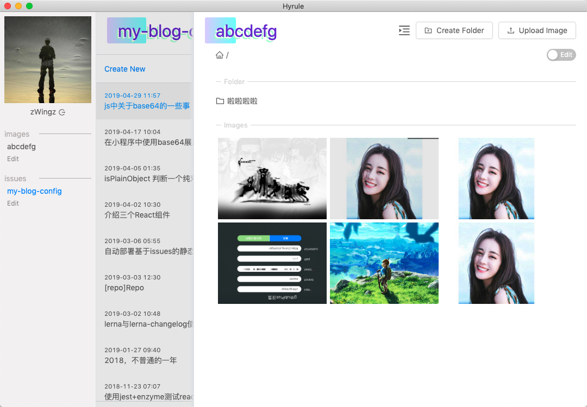
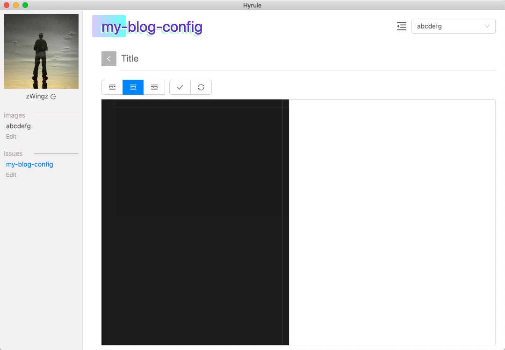

## Hyrule

An `electron` app

基于`github`来管理图片和`issues`文章。

### Image

使用`github`仓库来做图床

- 上传图片
- 删除图片
- 图片目录管理

### Issues

使用`github issues`来做博客, 可以[参考](https://zwing.site/posts/417715171.html)

- 创建`issues`
- 编辑`issues`
- 删除`issues`
- 将图片上传到默认图床

### Develop

- `yarn dev:web` 启动`web`服务
- `yarn dev:main` 编译主程序
- `yarn dev:electron` 启动`electron`

### Build

`yarn build`

### Demo

